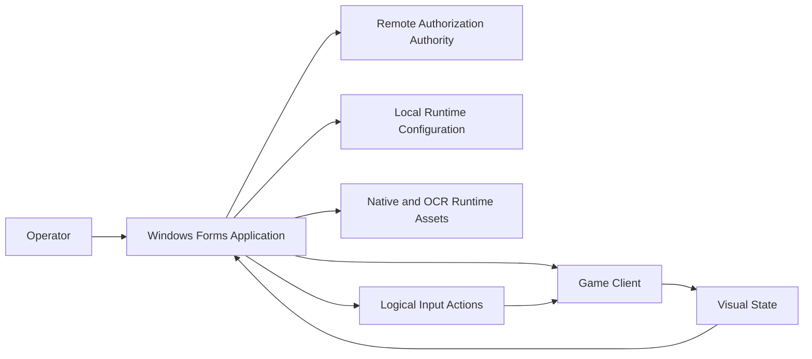
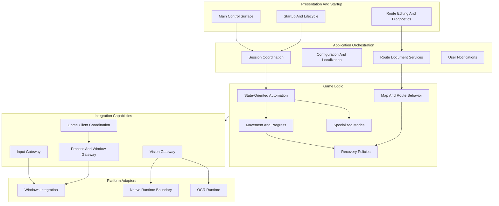
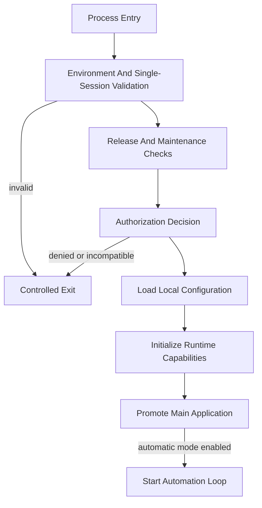
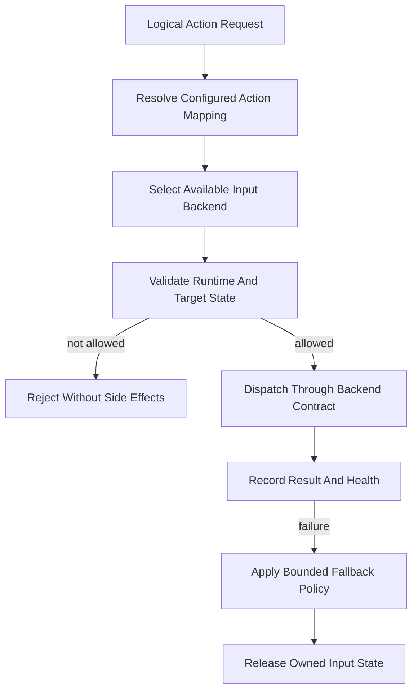
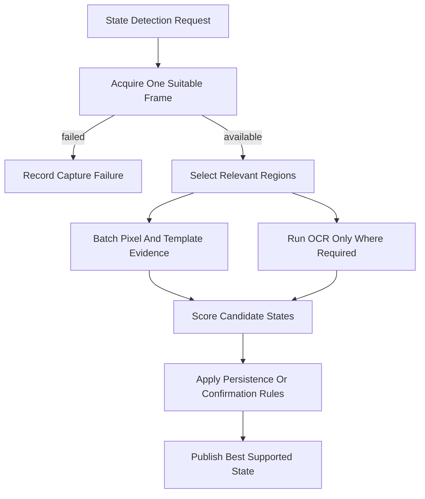
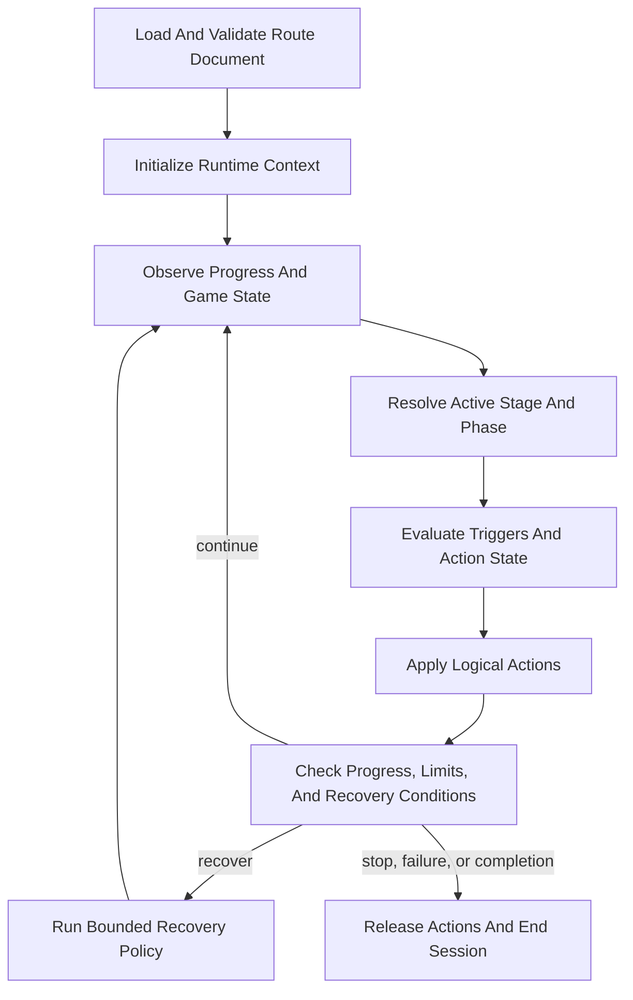
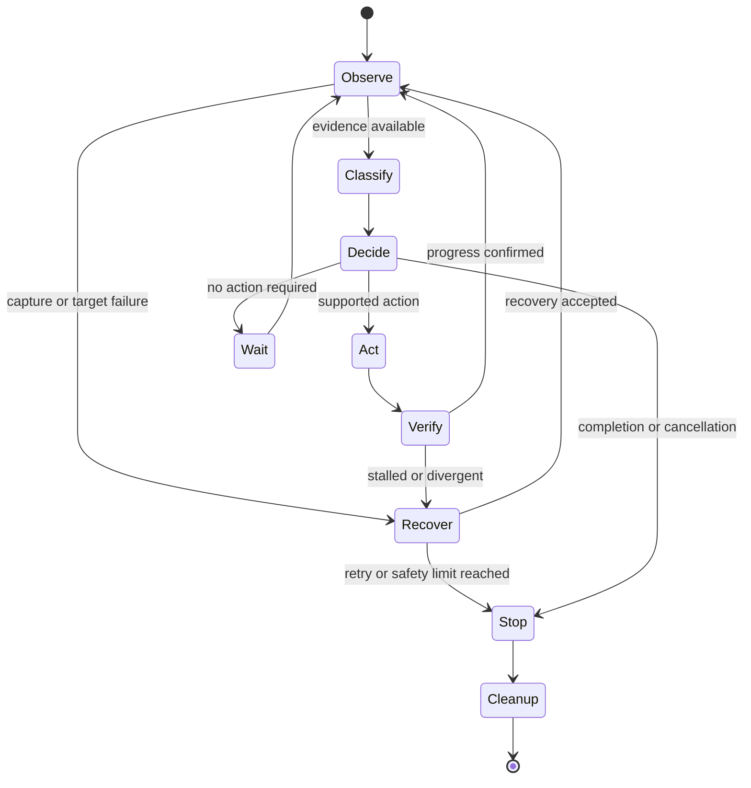

# AloneAIOR Public Architecture

> **Document type:** redacted architecture projection
> **Platform:** Windows x64, .NET Framework 4.8, Windows Forms
> **Repository role:** portfolio backbone and protected runtime distribution
> **Build status:** the public backbone is intentionally not buildable

## Table Of Contents

1. [Scope](#1-scope)
2. [System Context](#2-system-context)
3. [Responsibility Map](#3-responsibility-map)
4. [Critical Runtime Flows](#4-critical-runtime-flows)
5. [Subsystem Interaction Matrix](#5-subsystem-interaction-matrix)
6. [Layer Guide](#6-layer-guide)
7. [Runtime Automation Loop](#7-runtime-automation-loop)
8. [Architectural Patterns](#8-architectural-patterns)
9. [Operational Boundaries](#9-operational-boundaries)
10. [Public Backbone Layout](#10-public-backbone-layout)
11. [Public Contracts](#11-public-contracts)
12. [Non-Goals](#12-non-goals)

## 1. Scope

AloneAIOR is a Windows desktop automation runtime for Tales Runner. It combines visual state interpretation, route execution, input coordination, lifecycle management, diagnostics, and recovery in one Windows Forms application.

This document is derived from the production architecture but is intentionally written at responsibility and data-flow level. It answers:

- What capabilities exist?
- Which module owns each responsibility?
- How does runtime information move between modules?
- Where are platform and security boundaries?
- Which extension points are stable enough to show publicly?

It does not disclose production source, operational constants, native transport details, local secrets, protected document internals, or protection procedures.

## 2. System Context



### External boundaries

| Boundary | Responsibility | Public guarantee |
| --- | --- | --- |
| Operator | Starts, configures, pauses, and stops automation. | UI and lifecycle ownership are separate from route behavior. |
| Game client | Produces observable state and consumes input. | Game-specific integration is behind capability gateways. |
| Authorization authority | Returns signed authorization decisions. | Client-side code does not own server credentials or authority data. |
| Local configuration | Stores machine-local runtime preferences. | Live values are not tracked in this repository. |
| Runtime assets | Supply OCR and native platform capabilities. | Required relative paths are preserved in the release directory. |

## 3. Responsibility Map

The diagram below represents runtime coordination. It deliberately avoids claiming a perfectly strict compile-time dependency graph because orchestration and integration callbacks cross responsibility boundaries in the production runtime.



Cross-cutting capabilities support every responsibility area:

- diagnostics and structured logging;
- timing and bounded delays;
- thread-safe state primitives;
- local file and environment access;
- localization and user-facing messaging.

## 4. Critical Runtime Flows

The production architecture contains detailed method-level sequences. The public projection keeps decision and cleanup boundaries while removing private procedures.

### 4.1 Startup And Promotion



**Ownership rules:**

- Startup owns process promotion and shutdown paths.
- Authorization owns the decision to continue, not UI rendering.
- Configuration is loaded before automation capabilities are used.
- Failed promotion must not leave background work or input state active.

### 4.2 Input Dispatch



**Ownership rules:**

- Game logic requests actions; it does not format platform reports.
- Mapping providers own logical-name resolution.
- Backends own transport lifecycle and release semantics.
- Cleanup is mandatory when a route stops, fails, or changes backend.

### 4.3 Vision And State Classification



**Performance direction:**

- Reuse one suitable frame for related state checks.
- Prefer bounded regions over full-frame processing.
- Batch repeated pixel access.
- Pool expensive OCR resources.
- Treat capture failure as explicit evidence, not a valid game state.

### 4.4 Route Document Execution



**Ownership rules:**

- Route models describe intent; they do not own platform input.
- The executor owns phase state, trigger state, and cancellation.
- Recovery policy may request actions but must remain bounded.
- Every terminal path releases input and execution state.

## 5. Subsystem Interaction Matrix

The matrix describes capability use rather than production method calls.

| Caller | Client coordination | Input | Vision | Route execution | Diagnostics |
| --- | --- | --- | --- | --- | --- |
| Presentation | status and lifecycle | manual control | previews | start, pause, stop | display |
| Application orchestration | session and promotion | capability setup | capability setup | document/session setup | startup reporting |
| State automation | target lifecycle | logical actions | state evidence | mode selection | runtime reporting |
| Route executor | progress display | phase actions | progress evidence | phase ownership | route reporting |
| Recovery policy | recovery status | corrective actions | confirmation evidence | recovery result | failure reporting |
| Specialized modes | target state | mode actions | OCR or templates | optional route use | mode reporting |

## 6. Layer Guide

### 6.1 Presentation And Startup

| Aspect | Definition |
| --- | --- |
| Purpose | Provide operator control, startup feedback, route editing, and diagnostic presentation. |
| Owns | Windows Forms lifecycle, user commands, progress presentation, and controlled promotion. |
| Consumes | Application orchestration, notifications, and immutable status projections. |
| Excludes | Route algorithms, platform input formatting, visual classification, and server authority. |

### 6.2 Application Orchestration

| Aspect | Definition |
| --- | --- |
| Purpose | Coordinate startup, session state, authorization, configuration, localization, and route documents. |
| Owns | Process-level policy, application state transitions, document/session boundaries, and user-facing failures. |
| Consumes | Integration capability health and game-logic entry points. |
| Excludes | Game-specific movement decisions and native transport implementation. |

### 6.3 Game Logic

| Aspect | Definition |
| --- | --- |
| Purpose | Convert observed state and route intent into bounded automation decisions. |
| Owns | State-oriented workflows, progress interpretation, mode selection, route behavior, and recovery policy. |
| Consumes | Vision evidence, logical input actions, target lifecycle state, timing, and diagnostics. |
| Excludes | UI lifecycle, credential authority, report formatting, and native resource ownership. |

### 6.4 Integration Capabilities

| Aspect | Definition |
| --- | --- |
| Purpose | Present stable game-client, input, vision, process, and window capabilities to orchestration and logic. |
| Owns | Backend selection, target validation, frame acquisition coordination, and adapter health. |
| Consumes | Windows APIs, native runtime assets, OCR engines, local configuration, and diagnostics. |
| Excludes | Route policy and presentation decisions. |

### 6.5 Platform Adapters

| Aspect | Definition |
| --- | --- |
| Purpose | Isolate Windows, native library, OCR, and external-runtime details. |
| Owns | Resource lifecycle, platform calls, conversion at the boundary, and low-level error translation. |
| Consumes | Validated capability requests only. |
| Excludes | Game workflow, route state, and user-facing policy. |

## 7. Runtime Automation Loop



### Loop invariants

1. Decisions are based on explicit evidence or explicit failure state.
2. Recovery attempts have time, count, or progress bounds.
3. Cancellation is observed at repeated execution boundaries.
4. Held input is owned and released by the active execution context.
5. Repeated failures become diagnostics and controlled shutdown, not infinite retry.

## 8. Architectural Patterns

### Layered responsibility

Folders and documentation follow ownership boundaries even where the legacy runtime uses direct static calls. The public model describes the direction the system should be reasoned about, not a fictional guarantee that every private call is dependency-inverted.

### Backend strategy

Input and visual acquisition are capability contracts with runtime-selected implementations. Game logic depends on intent-level operations rather than implementation-specific structures.

### State machine and phase execution

Long-running automation is modeled as explicit states, phases, triggers, and terminal cleanup rather than deeply nested callbacks.

### Failure-oriented design

Capture health, target lifecycle, input availability, cancellation, timeout, and route completion are explicit control states.

### Performance-aware vision

The architecture favors shared frame use within one decision cycle, bounded regions, batched pixel access, pooled OCR resources, and predictable allocation behavior on repeated paths.

### Focused partial ownership

The production code uses partial classes to separate large runtime responsibilities. The public backbone presents those responsibilities as modules instead of publishing private file inventories.

## 9. Operational Boundaries

### Authorization

- Authorization decisions originate outside the Windows client.
- The client accepts signed, time-bounded decisions and maintains only current session state.
- Database credentials and server authority material do not belong in the client or this repository.
- Public documentation describes trust direction, not endpoints, keys, tokens, or verification internals.

### Configuration

- Live account and password configuration is machine-local.
- Tracked examples contain blank sensitive fields.
- The repository validation gate rejects tracked live configuration.

### Native integration

- Native adapters are treated as replaceable capabilities with explicit lifecycle and health.
- The public boundary does not describe transport layout, device format, target-process modification, or protection procedures.
- Managed logic must not depend on private native structures.

### Diagnostics

- Modules report structured state transitions and failures.
- High-frequency diagnostics are independently controllable.
- Logs must not contain credentials, authorization payloads, or private configuration values.
- Capture and backend health are reported separately from game-state evidence.

### Distribution

- The protected executable is distributed with required native and OCR assets.
- The readable backbone is not a reproducible build input.
- Live INI files are local and ignored.
- Public updates must pass `tools/Verify-PublicRepository.ps1`.

## 10. Public Backbone Layout

The public tree preserves responsibility areas without reproducing the production file inventory.

```text
AloneAIOR/
|-- bin/Debug/                         # Protected runtime distribution
|   `-- lib/
|       |-- x64/                       # Required native runtime assets
|       `-- tessdata/                  # Required OCR language data
|-- GameLogic/
|   |-- Contracts/                     # Public-safe automation contract
|   |-- Functions/
|   |   |-- Game/                      # State-oriented game workflows
|   |   |-- Run/                       # Movement and progress ownership
|   |   |-- Rooms/                     # Room-state workflows
|   |   `-- Map/
|   |       |-- Maps/                  # Route category boundary
|   |       |-- EventMap/              # Event route boundary
|   |       `-- Scripting/             # Route execution boundary
|   |-- MiniGames/                     # Specialized visual workflows
|   `-- Recovery/                      # Recovery policy boundary
`-- Infrastructure/
    |-- Application/
    |   |-- Architecture/              # Application composition boundary
    |   |-- Authentication/            # Authorization boundary
    |   |-- Configuration/             # Local settings boundary
    |   |-- Distribution/              # Release/update boundary
    |   |-- Localization/              # Language selection boundary
    |   |-- MainApplication/           # Presentation boundary
    |   |-- MapScripts/                # Route document boundary
    |   |-- Messaging/                 # User notification boundary
    |   `-- Startup/                   # Process lifecycle boundary
    |-- Diagnostics/                   # Logging and health reporting
    |-- GameIntegration/
    |   |-- Clients/                   # Game-client coordination
    |   `-- Input/                     # Logical input and backend contracts
    |-- IO/                            # Focused operating-system I/O
    |-- Platform/Windows/              # Windows adapter boundary
    |-- Process/                       # Process and window lifecycle
    |-- SystemServices/                # Timing, threading, text, and files
    `-- Vision/                        # Capture, OCR, matching, and state
```

## 11. Public Contracts

The backbone exposes five public-safe contracts:

| Contract | Responsibility |
| --- | --- |
| `IAutomationController` | Starts, pauses, resumes, and stops one automation session. |
| `IRouteExecutor` | Loads and controls one route execution context. |
| `IInputBackend` | Accepts logical action state and releases owned actions. |
| `IKeyMappingProvider` | Resolves configured logical action names. |
| `IVisionService` | Returns named state evidence without exposing capture transport. |

The contracts demonstrate ownership boundaries only. They are not a supported SDK and do not guarantee signature compatibility with private production types.

## 12. Non-Goals

- Reproducing the private implementation.
- Providing a compilable solution or package graph.
- Publishing native transport, device, protection, or target-modification procedures.
- Publishing route implementations, automation constants, or protected document secrets.
- Treating the public contracts as a production SDK.
- Moving runtime distribution away from `AloneAIOR/bin/Debug/`.
