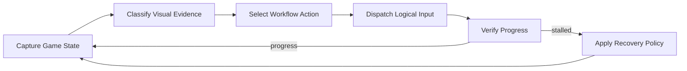

<div align="center">

# AloneAIO Framework

**Vision-driven Tales Runner automation for Windows**

Automated workflows, route execution, OCR, adaptive recovery, and multi-backend input in one desktop runtime.

[Download ZIP](https://github.com/AloneCodeA/AloneAIOR-V-/archive/refs/heads/main.zip) · [Getting Started](#getting-started) · [Features](#features) · [Architecture](ARCHITECTURE.md) · [繁體中文](README.zh-TW.md) · [Discord](https://discord.gg/tvjJdznEeT)

`Windows x64` · `.NET Framework 4.8` · `Tales Runner` · `Windows Forms`

</div>

---

## Overview

AloneAIO is a Windows desktop automation runtime for Tales Runner. It watches the game through computer vision, identifies the current state, runs the selected workflow, and applies recovery logic when progress stalls or the game leaves the expected state.

The runtime combines everyday automation features with an engineering-focused execution model: routes are stateful, input is centrally managed, visual checks are reusable, and every long-running workflow has explicit stop and cleanup paths.

## Highlights

| | Capability | Description |
| --- | --- | --- |
| **Automation** | Full workflow coordination | Coordinates game launch, login, rooms, maps, events, fishing, and repeated AFK operation. |
| **Vision** | State detection and OCR | Uses pixel evidence, template matching, and OCR to interpret the live game screen. |
| **Routes** | Phase-based map execution | Runs structured map routes with states, triggers, combos, and recovery zones. |
| **Recovery** | Adaptive correction | Detects stalled progress, retries safely, and escalates to controlled recovery. |
| **Input** | Configurable input modes | Resolves logical game actions through the selected input backend. |
| **Languages** | Multi-language UI support | Includes English, Traditional Chinese, Simplified Chinese, Korean, and Thai resources. |

## Features

### Automation Modes

- Automatic event workflows.
- Automatic map rotation and custom map routes.
- Fishing automation.
- Guild and room-oriented workflows.
- Daily task and item-use coordination.
- Quiz and mini-game assistance using OCR and text matching.
- Multi-account workflow support.

### Vision Runtime

- Game-state classification from one captured frame.
- Region-based pixel and color matching.
- Image template matching.
- OCR for numbers, text, and supported language content.
- Batched visual checks for repeated state detection.
- Capture-health monitoring and failure recovery.

### Route Runtime

- Versioned route documents.
- State, trigger, macro, and recovery phases.
- Configurable directional actions and combos.
- Pause, resume, stop, and terminal input cleanup.
- Progress-aware stage transitions.
- Runtime-only route logging.

### Adaptive Recovery

AloneAIO treats movement as a feedback loop rather than a fixed macro. It compares recent progress with expected movement, detects repeated stalls, selects a correction, verifies the result, and stops safely when recovery limits are reached.

## Getting Started

### Requirements

- Windows x64.
- .NET Framework 4.8.
- Tales Runner installed locally.
- 100% Windows display scaling for the expected capture coordinates.
- Administrator rights when required by the selected input mode.

### Install

1. [Download the repository ZIP](https://github.com/AloneCodeA/AloneAIOR-V-/archive/refs/heads/main.zip).
2. Extract the complete archive.
3. Open [`AloneAIOR/bin/Debug/`](AloneAIOR/bin/Debug/).
4. Edit `Alone.ini` for your local Tales Runner path and preferred mode.
5. Run `AloneAIOR.exe`.

Keep the complete `bin/Debug` directory together. The executable uses the native libraries and OCR data stored under `lib/`.

## Default Configuration

[`AloneAIOR/bin/Debug/Alone.ini`](AloneAIOR/bin/Debug/Alone.ini) is included as the default configuration.

Common settings:

| Section | Setting | Purpose |
| --- | --- | --- |
| `Setting` | `TRFile` | Local path to the Tales Runner executable. |
| `Setting` | `FullAuto` | Starts the configured automation workflow automatically. |
| `AFKmode` | `AFKmode` | Selects the main unattended mode. |
| `AFKmode` | `Map` / `AutoMap` | Selects fixed or automatic map behavior. |
| `Input` | `Mode` | Selects the configured input mode. |
| `Delay` | `SlowPC` | Enables more conservative timing for slower systems. |
| `RoomSetting` | `Channel` / `CreateRoom` | Controls room and channel behavior. |

`Account` and `Password` are blank in the tracked default file. Keep personal credentials local and do not commit them.

## How It Works



At runtime, the application repeatedly observes the game, decides what the active workflow requires, sends the corresponding logical actions, and verifies the result. Vision, input, route execution, and recovery remain separate responsibilities so each can be maintained independently.

## Runtime Layout

```text
AloneAIOR/bin/Debug/
|-- AloneAIOR.exe
|-- Alone.ini
`-- lib/
    |-- x64/
    |   |-- leptonica-1.80.0.dll
    |   |-- tesseract41.dll
    |   `-- winhid.dll
    `-- tessdata/
        |-- chi_tra.traineddata
        `-- eng.traineddata
```

## Architecture For Developers

The repository includes a readable architecture reference beside the runtime files. It shows the major responsibility areas, runtime flows, module ownership, and a small set of interface contracts.

- [`ARCHITECTURE.md`](ARCHITECTURE.md) - system architecture and runtime flows.
- [`docs/Readme.md`](docs/Readme.md) - documentation index.
- [`AloneAIOR/GameLogic/`](AloneAIOR/GameLogic/) - workflow, route, and recovery responsibilities.
- [`AloneAIOR/Infrastructure/`](AloneAIOR/Infrastructure/) - application, vision, input, process, and platform responsibilities.

The architecture reference is intended for reading and design study; the downloadable runtime remains under `AloneAIOR/bin/Debug`.

## Roadmap

The current research direction explores adaptive route selection based on progress evidence and bounded action scoring. See [`docs/AI-Pathfinding.md`](docs/AI-Pathfinding.md).

## Support

- Community and project support: [Discord](https://discord.gg/tvjJdznEeT)
- Security reporting: [`SECURITY.md`](SECURITY.md)
- Runtime files: [`AloneAIOR/bin/Debug/`](AloneAIOR/bin/Debug/)
