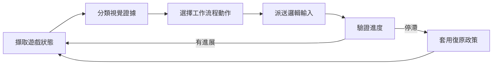

<div align="center">

# AloneAIO Framework

**以電腦視覺驅動的 Windows Tales Runner 自動化工具**

將自動工作流程、路線執行、OCR、自適應復原與多後端輸入整合於單一桌面執行階段。

[下載 ZIP](https://github.com/AloneCodeA/AloneAIOR-V-/archive/refs/heads/main.zip) · [開始使用](#開始使用) · [功能](#功能) · [架構](ARCHITECTURE.md) · [English](README.md) · [Discord](https://discord.gg/tvjJdznEeT)

`Windows x64` · `.NET Framework 4.8` · `Tales Runner` · `Windows Forms`

</div>

---

## 總覽

AloneAIO 是一套適用於 Tales Runner 的 Windows 桌面自動化執行階段。它透過電腦視覺觀察遊戲、辨識目前狀態、執行選定工作流程，並在進度停滯或遊戲離開預期狀態時進行復原。

此執行階段將日常自動化功能與工程化執行模型結合：路線具有狀態、輸入集中管理、視覺檢查可重用，而且每個長時間工作流程都有明確的停止與清理路徑。

## 特色概覽

| | 能力 | 說明 |
| --- | --- | --- |
| **自動化** | 完整工作流程協調 | 協調遊戲啟動、登入、房間、地圖、活動、釣魚與反覆 AFK 操作。 |
| **視覺** | 狀態偵測與 OCR | 使用像素證據、樣板比對與 OCR 解讀即時遊戲畫面。 |
| **路線** | Phase-based 地圖執行 | 執行包含狀態、觸發、combo 與復原區的結構化地圖路線。 |
| **復原** | 自適應修正 | 偵測進度停滯、安全重試，並在需要時升級至受控復原。 |
| **輸入** | 可設定輸入模式 | 透過選定的輸入後端解析邏輯遊戲動作。 |
| **語言** | 多語言 UI | 包含英文、繁體中文、簡體中文、韓文與泰文資源。 |

## 功能

### 自動化模式

- 自動活動工作流程。
- 自動地圖輪替與自訂地圖路線。
- 釣魚自動化。
- 公會與房間相關工作流程。
- 每日任務與道具使用協調。
- 使用 OCR 與文字比對的問答及小遊戲輔助。
- 多帳號工作流程支援。

### 視覺執行階段

- 從單一擷取畫面分類遊戲狀態。
- 區域式像素與色彩比對。
- 影像樣板比對。
- 數字、文字與支援語言內容的 OCR。
- 批次執行重複狀態檢查。
- 擷取健康狀態監控與失敗復原。

### 路線執行階段

- 版本化路線文件。
- 狀態、觸發、macro 與復原 phase。
- 可設定方向動作與 combo。
- 暫停、繼續、停止與終止輸入清理。
- 感知進度的階段轉換。
- 僅限執行階段的路線記錄。

### 自適應復原

AloneAIO 將移動視為回饋迴圈，而非固定巨集。它比較近期進度與預期移動、偵測反覆停滯、選擇修正、驗證結果，並在達到復原限制時安全停止。

## 開始使用

### 系統需求

- Windows x64。
- .NET Framework 4.8。
- 已在本機安裝 Tales Runner。
- Windows 顯示縮放設為 100%，以符合預期擷取座標。
- 選定的輸入模式需要時，具備系統管理員權限。

### 安裝

1. [下載倉庫 ZIP](https://github.com/AloneCodeA/AloneAIOR-V-/archive/refs/heads/main.zip)。
2. 解壓縮完整封存檔。
3. 開啟 [`AloneAIOR/bin/Debug/`](AloneAIOR/bin/Debug/)。
4. 編輯 `Alone.ini`，設定本機 Tales Runner 路徑與偏好模式。
5. 執行 `AloneAIOR.exe`。

請保持完整 `bin/Debug` 目錄結構。執行檔會使用 `lib/` 之下的原生函式庫與 OCR 資料。

## 預設設定

[`AloneAIOR/bin/Debug/Alone.ini`](AloneAIOR/bin/Debug/Alone.ini) 已作為預設設定包含在倉庫中。

常用設定：

| 區段 | 設定 | 用途 |
| --- | --- | --- |
| `Setting` | `TRFile` | 本機 Tales Runner 執行檔路徑。 |
| `Setting` | `FullAuto` | 自動啟動已設定的自動化工作流程。 |
| `AFKmode` | `AFKmode` | 選擇主要無人值守模式。 |
| `AFKmode` | `Map` / `AutoMap` | 選擇固定或自動地圖行為。 |
| `Input` | `Mode` | 選擇已設定的輸入模式。 |
| `Delay` | `SlowPC` | 為速度較慢的系統採用較保守時序。 |
| `RoomSetting` | `Channel` / `CreateRoom` | 控制房間與頻道行為。 |

追蹤的預設檔中，`Account` 與 `Password` 保持空白。個人憑證必須留在本機，請勿提交。

## 運作方式



執行期間，應用程式會反覆觀察遊戲、判斷目前工作流程需要的動作、傳送對應邏輯輸入，再驗證結果。視覺、輸入、路線執行與復原保持為獨立責任，以便分別維護。

## 執行階段布局

```text
AloneAIOR/bin/Debug/
|-- AloneAIOR.exe
|-- Alone.ini
`-- lib/
    |-- x64/
    |   |-- leptonica-1.80.0.dll
    |   |-- tesseract41.dll
    |   `-- winhid.dll
    `-- tessdata/
        |-- chi_tra.traineddata
        `-- eng.traineddata
```

## 開發者架構文件

倉庫在執行階段檔案旁提供可閱讀的架構參考，說明主要責任區域、執行流程、模組所有權與少量介面契約。

- [`ARCHITECTURE.md`](ARCHITECTURE.md) - 系統架構與執行階段流程。
- [`docs/Readme.md`](docs/Readme.md) - 文件索引。
- [`AloneAIOR/GameLogic/`](AloneAIOR/GameLogic/) - 工作流程、路線與復原責任。
- [`AloneAIOR/Infrastructure/`](AloneAIOR/Infrastructure/) - 應用程式、視覺、輸入、行程與平台責任。

架構參考供閱讀與設計研究；可下載的執行階段仍位於 `AloneAIOR/bin/Debug`。

## 路線圖

目前研究方向著重於依據進度證據與有限動作評分進行自適應路線選擇。詳見 [`docs/AI-Pathfinding.md`](docs/AI-Pathfinding.md)。

## 支援

- 社群與專案支援：[Discord](https://discord.gg/tvjJdznEeT)
- 安全問題回報：[`SECURITY.md`](SECURITY.md)
- 執行階段檔案：[`AloneAIOR/bin/Debug/`](AloneAIOR/bin/Debug/)
