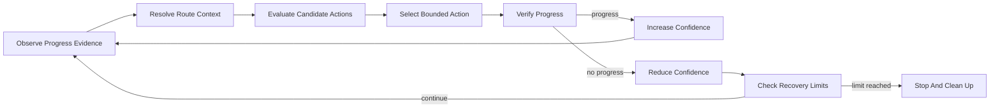

# Adaptive Route Selection Research

> **Status:** research direction, not a released feature.

## Problem

A fixed route can fail when observed movement differs from the expected path. A resilient runtime needs to distinguish temporary noise, local obstruction, route divergence, and terminal failure without allowing recovery behavior to become unbounded.

## Research Direction

The proposed model treats each observable route region as a decision context. Candidate actions receive evidence from prior attempts and current progress. The runtime can then prefer actions associated with reliable progress while reducing the priority of actions associated with repeated stalls.

This is not presented as unrestricted self-learning. Production automation still requires explicit safety, cancellation, cleanup, and confidence boundaries.

## Responsibility Model

## Design Constraints

- Evidence must decay or be versioned when route conditions change.
- Exploration must be bounded by explicit action, time, and retry limits.
- A state transition must not leave directional or action input held.
- Oscillation detection must prevent repeated switching between equivalent failures.
- Shared learning data must not contain account, device, or session identity.
- Offline behavior must remain deterministic enough to diagnose.

## Public Boundary

This document intentionally omits production state encoding, action scoring, thresholds, persistence schema, synchronization policy, and route-specific recovery tactics. It describes the problem and ownership model so independent implementations can explore different approaches.
